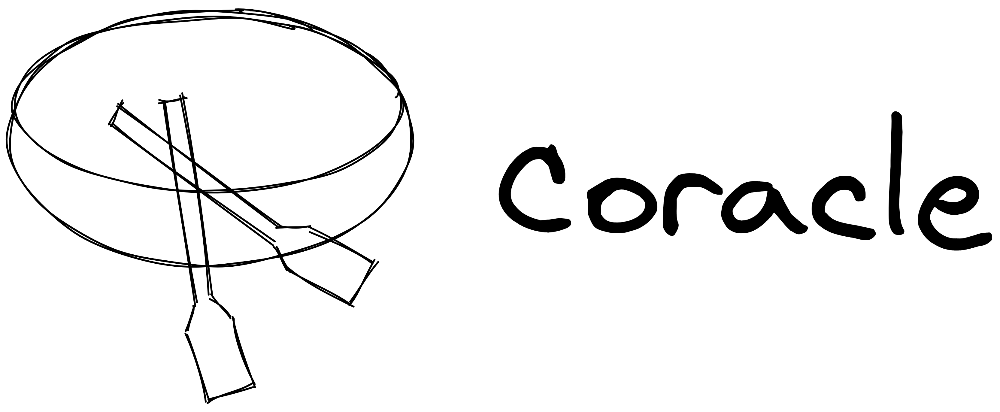
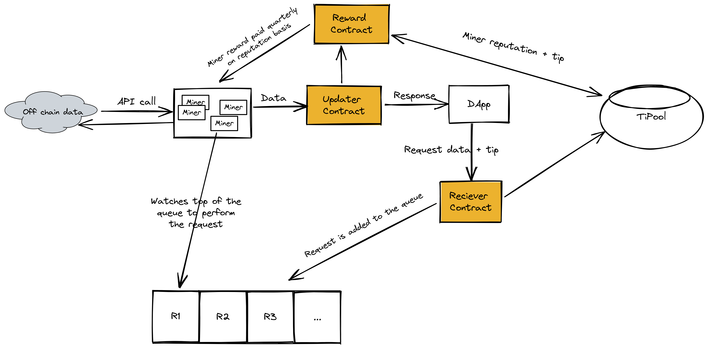
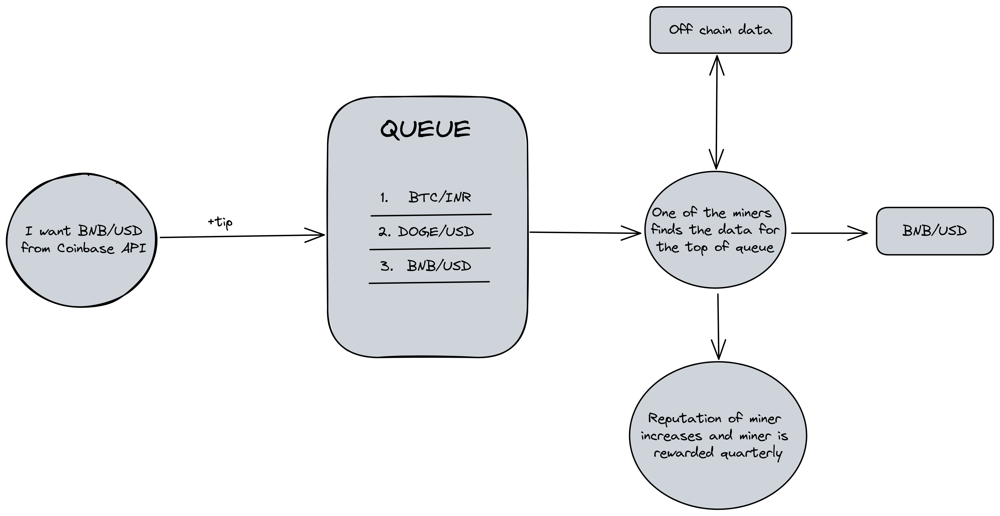
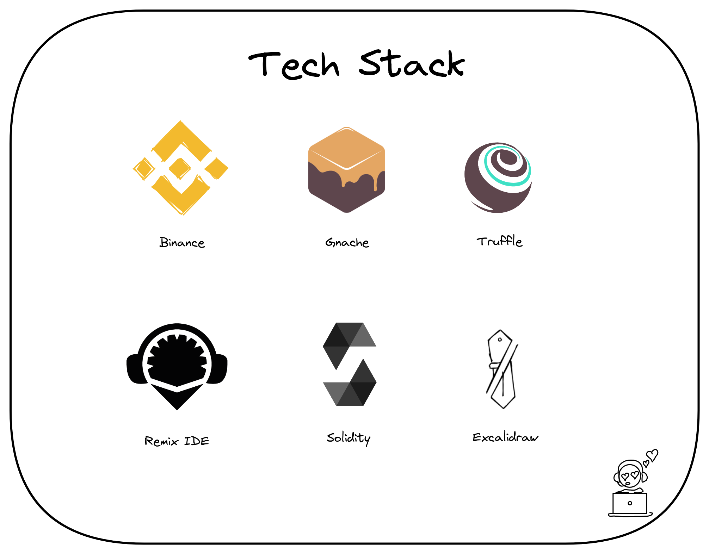
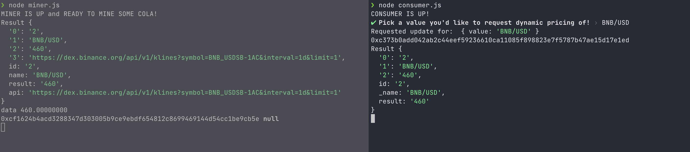

# Coracle

> A secure and decentralized boat from off-chain to on-chain



Coracle is a transparent price oracle on BSC(Binance Smart Chain). Coracle provides a trustless and decentralized alternative to Oracle. It provides the infrastructure for decentralized applications to query off-chain data by properly incentivizing miners to provide data in a unique way that benefits the blockchain and the miners.

## How it works

Ethereum smart contracts cannot access off-chain data. If your smart contract relies on off-chain (like internet) data to evaluate or execute a function, you either have to manually feed the data to your contract, incentivize users to do it, or rely on a centralized party to provide the data.



The Coracle (or Cola Oracle) is a decentralized oracle. It enables contracts to interact with and obtain off-chain data securely.

Coracle implements a reward mechanism where miners get rewarded using a time-based rewarding mechanism with reputation. When a miner provides the system with correct data, the reputation of the miner is increased, and over the quarter, this reputation is built. Once the quarter finishes, the reward(collected through the tips) is distributed amongst the miners in form of cryptocurrency tokens called Cola.

In short, the miner who has contributed for the longest with the correct values gets a higher share of tokens in reward every quarter.

Since data integrity is the priority, miners have to stay long enough and provide correct data to gain significant incentives, unlike an oracle where anyone can become a miner.

## Flow



## Tech Stack



## Installation

1. Clone this repo using `git clone https://github.com/DarthBenro008/coracle`
2. Make sure you have truffle and ganache installed
3. Run the following commands to deploy the smart contract
    ```bash
    truffle compile
    truffle migrate
    truffle test
    ```
4. Go to scripts directory
5. Run multiple instances of the `miner.js` file
6. Run the `consumer.js` file
7. You can mint the token by running the `owner.js` file
8. Ensure that you change the smart contract address in both the `miner.js` as well as the `owner.js` files!

## Screenshot



## Show your support

Give a ⭐ if you liked this project!

Spread the word to your fellows to help grow a healthy environment for us!

## License

Licensed under MIT License : https://opensource.org/licenses/MIT

<p align="center">Made with ❤ by Team Alpha</p>
